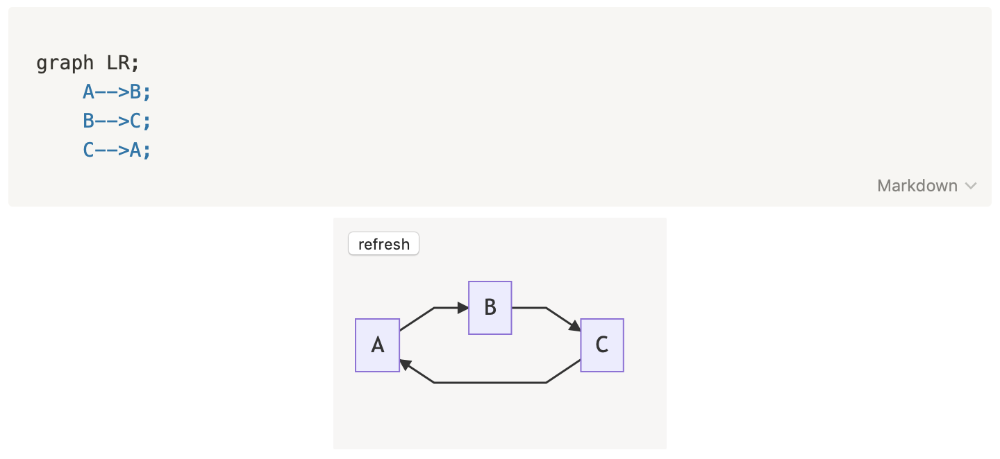

# notion-mermaid



[자세한 사용법](https://www.notion.so/ad4613bd7a174da695ec5cd109fdd06d)을 참조하세요

## 미리 알아둘 것

* 노션에 embed하려면 외부 주소가 있어야 함
* Cafe24 호스팅, Heroku 등등 여러가지가 있지만 [Apex Up](https://apex.sh/docs/up/)을 추천

## Apex Up 사용법

* [AWS Credential](https://apex.sh/docs/up/credentials/#aws_credential_profiles)을 준비하시오
* [IAM Policy](https://apex.sh/docs/up/credentials/#iam_policy_for_up_cli)를 복붙하시오

```bash
$ npm i
$ npx tsc
$ up && up open --url
     build: 6,460 files, 12 MB (1.565s)
     deploy: staging (commit f2b0afb) (3.699s)
     endpoint: https://t1p6ycwci4.execute-api.ap-northeast-2.amazonaws.com/staging/
```
* 요렇게 나온 주소를 사용하면 된다

## 개발 방법

```bash
$ npm i
$ npx tsc
$ ./bin/www
```

